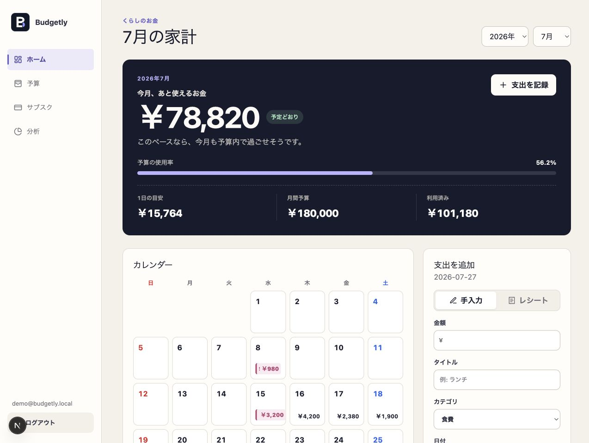
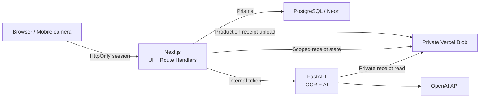

<p align="center">
  
</p>

<h1 align="center">Budgetly</h1>

<p align="center">
  <strong>毎月のお金を、わかりやすく。</strong><br />
  A Japanese personal finance application for budgets, expenses, subscriptions,
  receipt OCR, and AI-assisted spending insights.
</p>

<p align="center">
  
  
  
  
  
  
</p>

<p align="center">
  <a href="#features">Features</a> ·
  <a href="#design-and-ux">Design & UX</a> ·
  <a href="#architecture">Architecture</a> ·
  <a href="#local-development">Local setup</a> ·
  <a href="#testing">Testing</a> ·
  <a href="./docs/vercel.md">Deployment</a>
</p>

---

## Overview

Budgetly helps users understand how much they can still spend this month.
Instead of only recording transactions, it combines monthly budgets, recurring
costs, receipt capture, and concise Japanese insights in one responsive
workflow.

```text
Create account -> Set monthly budget -> Add or scan expenses
-> Review dashboard -> Understand spending patterns
```

## Product Preview



## Design and UX

Budgetly is designed as a warm digital household ledger rather than a generic
analytics dashboard. The interface uses a paper-like canvas, deep navy
financial summary, violet interaction color, and a separate pink accent for
recurring costs.

| Principle | Product behavior |
| --- | --- |
| Remaining money first | The dashboard leads with how much can still be spent, budget usage, and a short next-step message |
| Fast expense capture | A prominent action opens manual or receipt-based entry and moves focus directly to the amount field |
| Responsive by content | Desktop uses a persistent sidebar; tablet and mobile use a compact header and bottom navigation |
| Mobile-readable calendar | Dense amounts become color-coded indicators while accessible labels retain exact totals |
| Predictable feedback | Loading, success, empty, error, submitting, focus, and selected states are explicitly represented |
| Accessible analysis | Charts include text alternatives, controls have accessible names, and live updates use status or alert semantics |

The primary screens were manually checked at 375 px, 768 px, and 1280 px
without horizontal overflow. Calendar navigation, quick entry focus, collapsed
form behavior, and mobile touch targets were also verified in the browser.

## Features

| Area | What users can do |
| --- | --- |
| Dashboard | See remaining money, budget pace, daily allowance, selected-day spending, and upcoming fixed costs |
| Monthly budget | Set one JPY budget per month and track usage and remaining money |
| Expenses | Add quickly by hand or receipt, then edit, delete, filter, and review spending by date |
| Subscriptions | Manage recurring monthly costs and cancellation dates |
| Receipt capture | Upload an image or open the rear camera on supported mobile browsers |
| Receipt review | Correct merchant, date, amount, and category before creating an expense |
| Reports | Compare category totals and all 12 months of a selected year |
| AI insights | Receive structured Japanese summaries and practical recommendations |
| Responsive UI | Use purpose-built desktop, tablet, and mobile navigation and layouts |
| Accessible states | Understand focus, loading, success, errors, selections, and chart data without relying on color alone |

## Architecture

Budgetly uses Next.js as the product and security boundary. Python is separated
only for image, OCR, and AI workloads where its ecosystem is useful.



### Responsibility Boundary

**Next.js**

- authentication, sessions, authorization, and user ownership
- categories, budgets, expenses, and subscriptions
- deterministic dashboard and report calculations
- receipt state, confirmation, storage metadata, and retries
- AI rate limiting, request shaping, and result caching

**FastAPI**

- receipt image validation and normalization
- OCR and multimodal extraction
- OpenAI structured-output validation
- natural-language spending insights

FastAPI never queries product tables directly. Next.js loads only the
authenticated user's data and sends a bounded internal request.

## Tech Stack

| Layer | Technology |
| --- | --- |
| Web application | Next.js 16, React 19, TypeScript |
| UI | CSS design tokens, Recharts, Lucide |
| Main API | Next.js App Router Route Handlers |
| Validation | Zod, Pydantic |
| Authentication | Hashed server-side session + `HttpOnly` cookie |
| Database | PostgreSQL 17, Prisma 7, Neon adapter |
| AI service | Python 3.14, FastAPI, Pillow, OpenAI SDK |
| File storage | Local private volume / private Vercel Blob |
| Background work | Next.js `after()` / optional Vercel Queues |
| Development | Docker Compose |
| Production target | Vercel + Neon |

## Project Structure

```text
Budgetly/
├── frontend/
│   ├── prisma/               # PostgreSQL schema and migrations
│   ├── src/app/api/          # Browser-facing Route Handlers
│   ├── src/components/       # Product UI and receipt workflow
│   ├── src/server/           # Auth, reports, storage, queue, AI client
│   └── tests/                # Unit and API integration tests
├── ai-service/
│   ├── app/routers/          # Internal FastAPI endpoints
│   ├── app/providers/        # Fake and OpenAI providers
│   ├── app/services/         # Image and Blob processing
│   └── tests/                # Provider and API tests
├── docs/
├── docker-compose.yml
└── README.md
```

## Local Development

### Requirements

- Docker Desktop
- Docker Compose v2

### Start

```bash
cp .env.example .env
docker compose up -d --build
```

The frontend container installs dependencies and runs committed Prisma
migrations before starting Next.js.

| Service | URL |
| --- | --- |
| Budgetly | http://127.0.0.1:5173 |
| Main API health | http://127.0.0.1:5173/api/health |
| FastAPI health | http://127.0.0.1:8000/health |
| FastAPI readiness | http://127.0.0.1:8000/ready |
| PostgreSQL | `127.0.0.1:5432` |

### AI Provider Modes

Local development uses deterministic fake providers. It does not consume
OpenAI credits.

```dotenv
AI_RECEIPT_PROVIDER=fake
AI_REPORT_PROVIDER=fake
```

Real extraction and generated reports are enabled independently:

```dotenv
AI_RECEIPT_PROVIDER=openai
AI_REPORT_PROVIDER=openai
OPENAI_API_KEY=your-key
AI_OPENAI_MODEL=gpt-4o-mini
```

After changing AI settings:

```bash
docker compose up -d --build ai-service
```

## Testing

| Check | Command |
| --- | --- |
| Next.js lint | `docker compose run --rm --no-deps frontend npm run lint` |
| TypeScript | `docker compose run --rm --no-deps frontend npm run typecheck` |
| Unit tests | `docker compose run --rm --no-deps frontend npm run test:run` |
| Production build | `docker compose run --rm --no-deps frontend npm run build` |
| API integration | `docker compose run --rm --no-deps -e BUDGETLY_INTEGRATION_BASE_URL=http://frontend:5173 frontend npm run test:integration` |
| FastAPI lint | `docker compose exec ai-service ruff check .` |
| FastAPI tests | `docker compose exec ai-service pytest` |
| Migration status | `docker compose exec frontend npm run db:status` |

The integration scenario covers registration, default categories, budget
uniqueness, expense and subscription totals, cross-user access denial, AI
insights, receipt analysis, one-time confirmation, and image cleanup.

## Security Decisions

- Passwords use bcrypt and enforce its 72-byte safe input boundary.
- Session tokens are random; only SHA-256 hashes are stored in PostgreSQL.
- Production cookies are `HttpOnly`, `Secure`, and `SameSite=Lax`.
- Every product query includes the authenticated user's ID.
- Cross-user object IDs return `404`.
- PostgreSQL constraints protect amounts, dates, uniqueness, and file size.
- Receipt files are checked by actual image type, size, dimensions, and MIME.
- FastAPI analysis routes require a shared internal service token.
- AI reports and receipt uploads use database-backed rate limits.
- OpenAI is optional, cacheable, and disabled by default locally.

## Deployment

The production design uses two Vercel projects from this repository:

1. `frontend` for Next.js and the browser-facing API
2. `ai-service` for the internal FastAPI function

Neon is connected to the frontend project. The same private Vercel Blob store
is connected to both projects so FastAPI can read receipt images without
forwarding large multipart bodies between Functions.

See [Vercel deployment](./docs/vercel.md) for environment variables, migration
order, Blob setup, queue options, smoke tests, and rollback guidance.

## Documentation

| Document | Contents |
| --- | --- |
| [Architecture](./docs/architecture.md) | Service boundaries and request flows |
| [API](./docs/api.md) | Browser API and internal FastAPI contracts |
| [Database](./docs/database.md) | Prisma models, constraints, and migrations |
| [Docker](./docs/docker.md) | Local environment and troubleshooting |
| [AI service](./docs/ai-service.md) | Providers, image processing, and contracts |
| [QA checklist](./docs/qa-checklist.md) | Automated and manual acceptance checks |
| [Roadmap](./docs/roadmap.md) | Completed work and next production phase |
