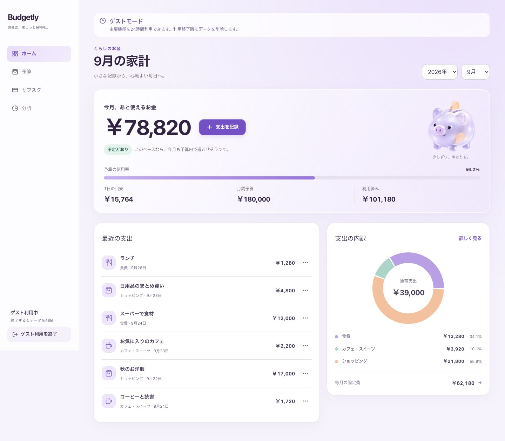
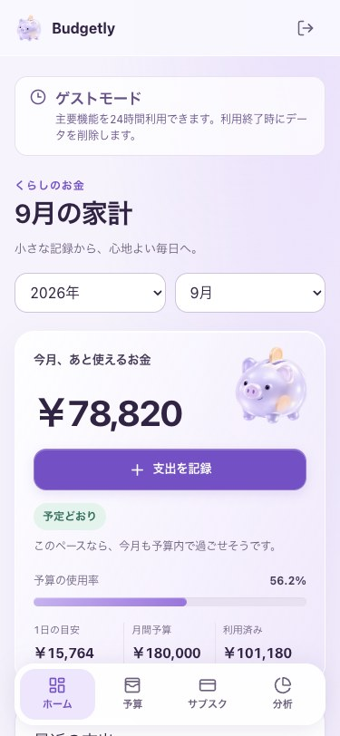
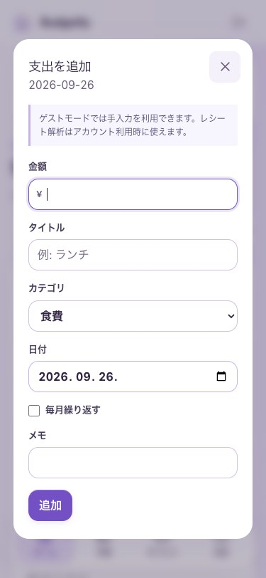
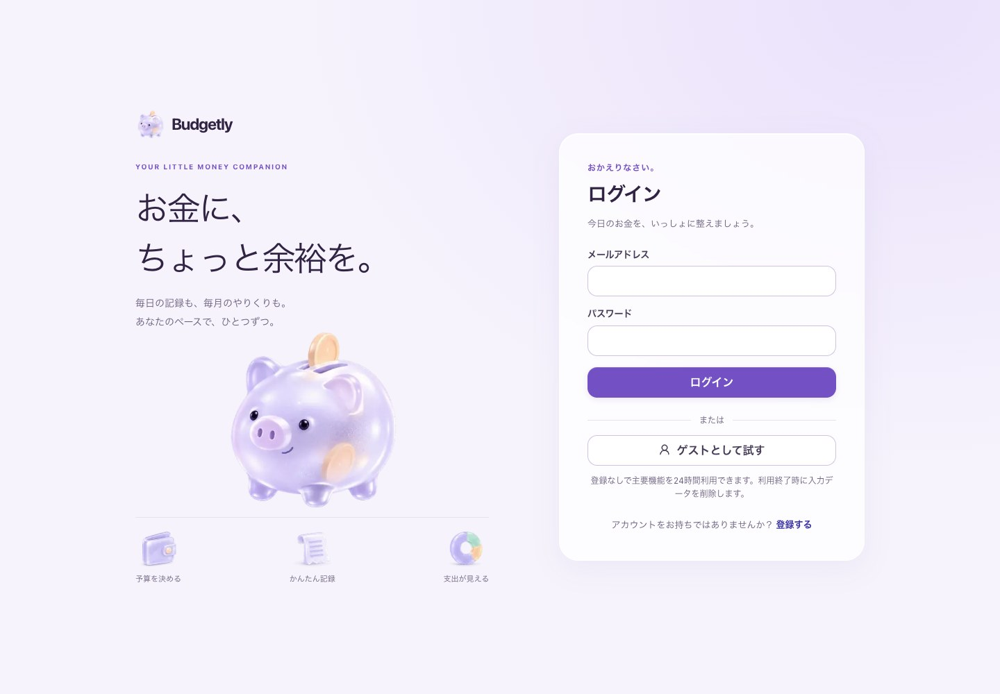
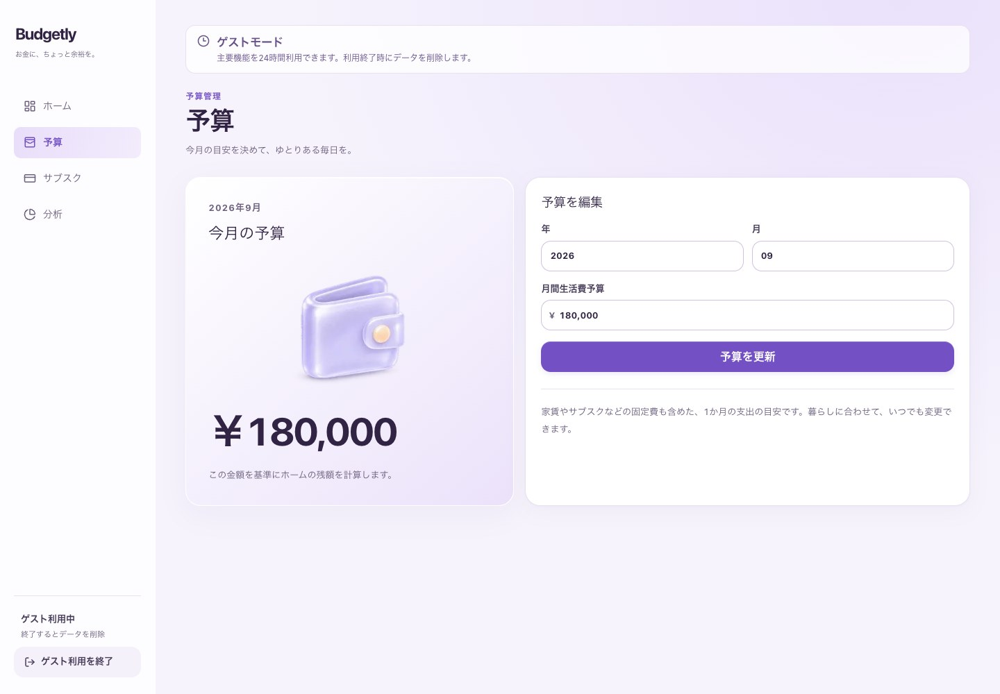
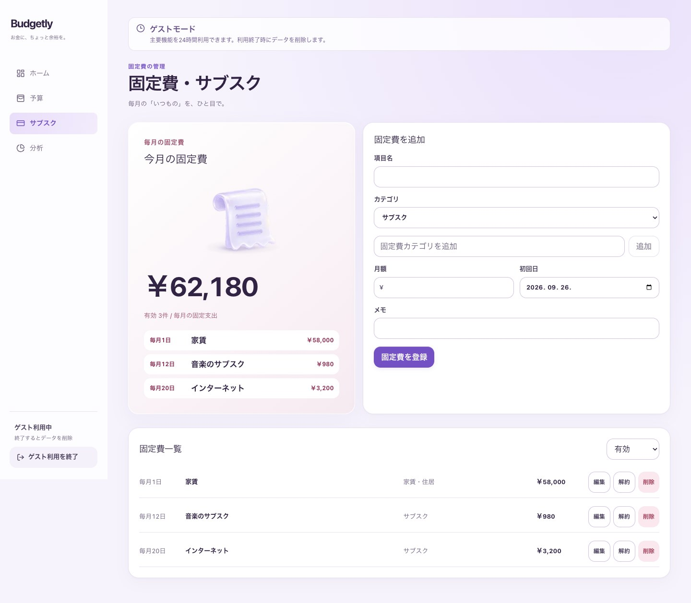
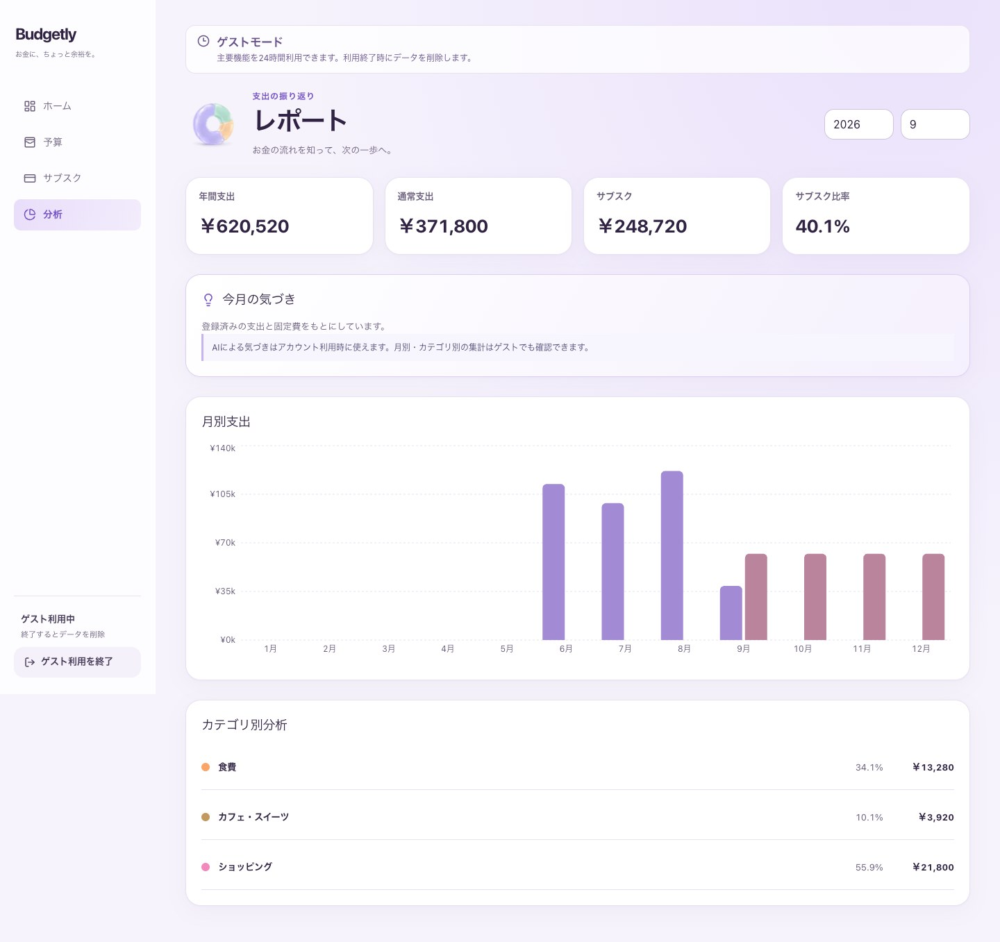
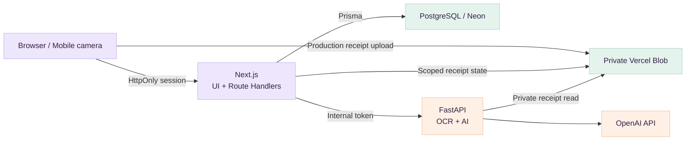

<p align="center">
  
</p>

<h1 align="center">Budgetly</h1>

<p align="center">
  <strong>お金に、ちょっと余裕を。</strong><br />
  Small everyday records. A little more breathing room.
</p>

<p align="center">
  A Japanese household budget app for knowing what you can still spend this month.<br />
  Monthly budgets, daily expenses, and recurring payments — in one calm place.
</p>

<p align="center">
  
  
  
  <a href="https://github.com/gunchou02/Budgetly/actions/workflows/ci.yml">
    
  </a>
</p>

<p align="center">
  <a href="https://budgetly-jp.vercel.app">Try Budgetly</a> ·
  <a href="#a-look-inside">Screens</a> ·
  <a href="#design-and-ux">Design</a> ·
  <a href="#local-development">Run locally</a> ·
  <a href="#architecture">Architecture</a> ·
  <a href="#documentation">Docs</a>
</p>

## A little room in your budget

The home screen starts with one useful question: **how much can I still spend?**
Your remaining balance, daily allowance, recent expenses, and category breakdown
sit together, so the next step is easy to find.

<table>
  <tr>
    <td width="33%" align="center">
      <br />
      <strong>予算を決める</strong><br />
      Set a monthly budget that fits your life.
    </td>
    <td width="33%" align="center">
      <br />
      <strong>かんたん記録</strong><br />
      Record an expense while it is still fresh.
    </td>
    <td width="33%" align="center">
      <br />
      <strong>支出が見える</strong><br />
      See where this month's money is going.
    </td>
  </tr>
</table>

**Start without an account:** choose **ゲストとして試す** on the login screen.
Guest access lasts 24 hours; leaving guest mode deletes that guest's data.
Receipt processing and generated AI insights require a member account.

## A look inside

### Your month at a glance

A clear balance, one expense-entry action, and a recent transaction list beside
the category chart. The desktop sidebar keeps the Budgetly wordmark and navigation;
the glass companion lives in the balance summary.



### On your phone

A compact header, bottom navigation, and an expense dialog with a focused amount
field keep the same flow comfortable on a smaller screen.

<table>
  <tr>
    <th align="center">Home</th>
    <th align="center">Record an expense</th>
  </tr>
  <tr>
    <td width="50%" align="center"></td>
    <td width="50%" align="center"></td>
  </tr>
</table>

<details>
<summary><strong>Explore login, budgets, subscriptions, and reports</strong></summary>

| Welcome back | Set your monthly budget |
| --- | --- |
|  |  |

| Keep recurring payments together | Look back at your spending |
| --- | --- |
|  |  |

</details>

<sub>Actual application captures using illustrative data in an isolated guest account. Development tool overlays are omitted. No personal financial records are shown.</sub>

## Design and UX

**Soft Glass Buddy** pairs a frosted lavender piggy bank with milky surfaces,
soft mint and apricot chart colors, and quiet typography. Illustration adds
warmth; balances, controls, and transaction details stay easy to read.

| Design choice | In the app |
| --- | --- |
| Lavender canvas · `#F6F3FC` | A calm background shared by every screen |
| Plum text · `#302344` | Clear headings, balances, and transaction amounts |
| Lavender action · `#7350C4` | One clear primary action per task |
| Glass illustrations | A companion on home and matching wallet, receipt, and chart assets |
| Simple navigation | A wordmark-only desktop sidebar; compact navigation on tablet and mobile |
| Keyboard-friendly entry | Native modal dialog, amount focus, Escape to close, and restored focus |
| Readable feedback | Explicit loading, empty, saving, success, and error states |

The UI was checked at **375, 768, and 1280 px**, including document overflow,
image loading, and the main expense flow. Motion respects reduced-motion
preferences. See the [design system](./docs/design-system.md) for tokens,
asset prompts, and the scope of visual verification.

## Features

| Area | What users can do |
| --- | --- |
| Home | See remaining money, budget usage, daily allowance, recent expenses, and category totals |
| Budgets | Set one JPY budget per month and follow the remaining balance |
| Expenses | Add, edit, delete, switch months, and expand the recent list to view the whole month |
| Recurring costs | Manage monthly payments, billing dates, and cancellations |
| Receipt review | Upload an image or use a supported mobile camera; review extracted details before saving |
| Reports | Compare spending categories and all 12 months of a year |
| AI insights | Read structured Japanese summaries and suggestions when the configured provider is enabled |

## Architecture

Budgetly uses Next.js as the product and security boundary. Python is separated
only for image, OCR, and AI workloads where its ecosystem is useful.


```mermaid
flowchart LR
    Browser["Browser / Mobile camera"]
    Next["Next.js<br/>UI + Route Handlers"]
    DB["PostgreSQL / Neon"]
    Blob["Private Vercel Blob"]
    Python["FastAPI<br/>OCR + AI"]
    OpenAI["OpenAI API"]

    Browser -->|"HttpOnly session"| Next
    Browser -->|"Production receipt upload"| Blob
    Next -->|"Prisma"| DB
    Next -->|"Scoped receipt state"| Blob
    Next -->|"Internal token"| Python
    Python -->|"Private receipt read"| Blob
    Python --> OpenAI

    classDef lavender fill:#eee6fc,stroke:#c7b4ee,color:#302344;
    classDef mint fill:#e5f3ed,stroke:#acd4c9,color:#302344;
    classDef peach fill:#fff0e6,stroke:#f4c19e,color:#302344;
    class Browser,Next lavender;
    class DB,Blob mint;
    class Python,OpenAI peach;
```

### Responsibility Boundary

**Next.js**

- authentication, sessions, authorization, and user ownership
- categories, budgets, expenses, and subscriptions
- deterministic dashboard and report calculations
- receipt state, confirmation, storage metadata, and retries
- AI rate limiting, request shaping, and result caching

**FastAPI**

- receipt image validation and normalization
- OCR and multimodal extraction
- OpenAI structured-output validation
- natural-language spending insights

FastAPI never queries product tables directly. Next.js loads only the
authenticated user's data and sends a bounded internal request.

## Tech Stack

| Layer | Technology |
| --- | --- |
| Web application | Next.js 16, React 19, TypeScript |
| UI | CSS design tokens, Recharts, Lucide |
| Main API | Next.js App Router Route Handlers |
| Validation | Zod, Pydantic |
| Authentication | Hashed server-side session + `HttpOnly` cookie |
| Database | PostgreSQL 17, Prisma 7, Neon adapter |
| AI service | Python 3.13, FastAPI, Pillow, OpenAI SDK |
| File storage | Local private volume / private Vercel Blob |
| Background work | Next.js `after()` / optional Vercel Queues |
| Development | Docker Compose |
| CI and security | GitHub Actions, Dependabot, npm audit, pip-audit |
| Production target | Vercel + Neon |

## Project Structure

```text
Budgetly/
├── .github/                 # CI workflow and dependency updates
├── frontend/
│   ├── prisma/               # PostgreSQL schema and migrations
│   ├── src/app/api/          # Browser-facing Route Handlers
│   ├── src/components/       # Product UI and receipt workflow
│   ├── src/server/           # Auth, reports, storage, queue, AI client
│   └── tests/                # Unit and API integration tests
├── ai-service/
│   ├── app/routers/          # Internal FastAPI endpoints
│   ├── app/providers/        # Fake and OpenAI providers
│   ├── app/services/         # Image and Blob processing
│   └── tests/                # Provider and API tests
├── docs/
├── docker-compose.yml
└── README.md
```

## Local Development

### Requirements

- Docker Desktop
- Docker Compose v2

### Start

```bash
cp .env.example .env
docker compose up -d --build
```

The frontend container installs dependencies and runs committed Prisma
migrations before starting Next.js.

| Service | URL |
| --- | --- |
| Budgetly | http://127.0.0.1:5173 |
| Main API health | http://127.0.0.1:5173/api/health |
| FastAPI health | http://127.0.0.1:8000/health |
| FastAPI readiness | http://127.0.0.1:8000/ready |
| PostgreSQL | `127.0.0.1:5432` |

### AI Provider Modes

Local development uses deterministic fake providers. It does not consume
OpenAI credits.

```dotenv
AI_RECEIPT_PROVIDER=fake
AI_REPORT_PROVIDER=fake
```

Real extraction and generated reports are enabled independently:

```dotenv
AI_RECEIPT_PROVIDER=openai
AI_REPORT_PROVIDER=openai
OPENAI_API_KEY=your-key
AI_OPENAI_MODEL=gpt-4o-mini
```

After changing AI settings:

```bash
docker compose up -d --build ai-service
```

## Testing

| Check | Command |
| --- | --- |
| Next.js lint | `docker compose run --rm --no-deps frontend npm run lint` |
| TypeScript | `docker compose run --rm --no-deps frontend npm run typecheck` |
| Unit tests | `docker compose run --rm --no-deps frontend npm run test:run` |
| Production build | `docker compose run --rm --no-deps frontend npm run build` |
| npm production audit | `docker compose run --rm --no-deps frontend npm audit --omit=dev --audit-level=high` |
| API integration | `docker compose run --rm --no-deps -e BUDGETLY_INTEGRATION_BASE_URL=http://frontend:5173 frontend npm run test:integration` |
| FastAPI lint | `docker compose exec ai-service ruff check .` |
| FastAPI tests | `docker compose exec ai-service pytest` |
| Python production audit | `docker compose exec ai-service pip-audit --cache-dir /tmp/pip-audit -r requirements.txt` |
| Migration status | `docker compose exec frontend npm run db:status` |

The integration scenario covers registration, default categories, budget
uniqueness, expense and subscription totals, cross-user access denial, AI
insights, receipt analysis, one-time confirmation, and image cleanup.
GitHub Actions runs the same quality and security gates for every pull request
and every push to `main`.

## Security Decisions

- Passwords use bcrypt and enforce its 72-byte safe input boundary.
- Session tokens are random; only SHA-256 hashes are stored in PostgreSQL.
- Production cookies are `HttpOnly`, `Secure`, and `SameSite=Lax`.
- Each guest receives an isolated temporary user and 24-hour session; guest data is removed on exit and expired accounts are cleaned by a protected daily job.
- Guest entry and registration are address-rate-limited using an HMAC pseudonym, without storing the raw proxy-provided address.
- Guest CRUD records have bounded quotas, and the daily cleanup also removes expired rate-limit buckets.
- Receipt OCR and generated AI insights require a member account; their costly entry points are limited by both user and address. This keeps the guest path free of external Blob and AI resources.
- Every product query includes the authenticated user's ID.
- Cross-user object IDs return `404`.
- PostgreSQL constraints protect amounts, dates, uniqueness, and file size.
- Receipt files are checked by actual image type, size, dimensions, and MIME.
- FastAPI analysis routes require a shared internal service token.
- AI reports and receipt uploads use database-backed rate limits.
- OpenAI is optional, cacheable, and disabled by default locally.
- CI rejects high or critical npm production advisories.
- Python production requirements are checked against known vulnerability data.
- Dependabot tracks npm, pip, GitHub Actions, and Docker updates weekly.

## Deployment

The production design uses two Vercel projects from this repository:

1. `frontend` for Next.js and the browser-facing API
2. `ai-service` for the internal FastAPI function

Both projects deploy from `main` through their GitHub integration.

Neon is connected to the frontend project. The same private Vercel Blob store
is connected to both projects so FastAPI can read receipt images without
forwarding large multipart bodies between Functions.

| Production endpoint | URL |
| --- | --- |
| Budgetly | https://budgetly-jp.vercel.app |
| Main API health | https://budgetly-jp.vercel.app/api/health |
| FastAPI health | https://budgetly-ai-ten.vercel.app/health |

Production currently uses deterministic fake AI providers, so the deployed
receipt and report flows do not consume OpenAI credits. Real providers remain
an explicit, independently controlled production setting.

See [Vercel deployment](./docs/vercel.md) for environment variables, migration
order, Blob setup, queue options, smoke tests, and rollback guidance.

## Documentation

| Document | Contents |
| --- | --- |
| [Design system](./docs/design-system.md) | Visual direction, tokens, assets, and verification |
| [Architecture](./docs/architecture.md) | Service boundaries and request flows |
| [API](./docs/api.md) | Browser API and internal FastAPI contracts |
| [Database](./docs/database.md) | Prisma models, constraints, and migrations |
| [Docker](./docs/docker.md) | Local environment and troubleshooting |
| [AI service](./docs/ai-service.md) | Providers, image processing, and contracts |
| [QA checklist](./docs/qa-checklist.md) | Automated and manual acceptance checks |
| [Roadmap](./docs/roadmap.md) | Completed work and next production phase |
