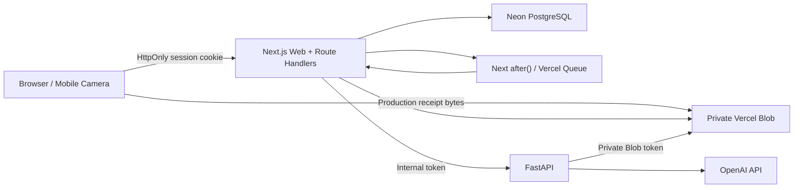

# Target Architecture

## Overview

Budgetly uses Next.js as the product boundary and FastAPI as an internal
compute service.

## Responsibilities

### Next.js

Next.js is the only browser-facing application API.

- authenticates users and manages session cookies
- validates request payloads with Zod
- enforces user ownership for every record
- performs categories, budgets, expenses, and subscriptions CRUD
- calculates dashboard and deterministic reports
- owns receipt status, storage metadata, retries, and confirmation
- caches AI reports and applies rate limits
- sends bounded, user-scoped payloads to FastAPI

The user's financial data must never be queried by FastAPI directly. This keeps
authorization in one place and reduces the blast radius of the AI service.

### FastAPI

FastAPI handles work that benefits from Python libraries or external AI models.

- image normalization and safety checks
- receipt OCR or multimodal extraction
- structured merchant, date, amount, and confidence output
- natural-language monthly spending insights
- future CPU-heavy analysis or batch processing

FastAPI endpoints require `X-Internal-Token`. The service returns typed JSON;
Next.js validates that response before storing or returning it.

### PostgreSQL and Prisma

PostgreSQL is the source of truth for:

- users and hashed sessions
- finance records
- receipt processing state and extracted results
- AI report cache entries
- fixed-window rate-limit buckets

Prisma migrations are committed under `frontend/prisma/migrations`. Local
Docker uses PostgreSQL 17 and production uses Neon PostgreSQL.

### Storage and Queues

Receipt images are private.

- Local: `.local-storage/receipts` in the frontend container volume.
- Production: private Vercel Blob paths scoped to `receipts/{userId}/{jobId}`.

The default queue driver is `inline`, which schedules processing with Next.js
`after()` after the response has been committed. `BUDGETLY_QUEUE_DRIVER=vercel`
enables the `budgetly-receipts` Vercel Queue for durable retries.

## Authentication Flow

1. The browser posts credentials to `/api/register` or `/api/login`, or sends
   an empty JSON request to `/api/guest`.
2. Member login verifies the password with bcrypt. Guest entry creates a
   separate temporary user with its own default categories and a 24-hour
   expiration; guests never share a demo account.
3. Next.js creates a cryptographically random token.
4. Only its SHA-256 hash is inserted into `sessions`.
5. The raw token is returned only as an `HttpOnly` cookie.
6. Protected routes hash the cookie and load a non-expired session. The same
   `userId` ownership checks isolate both member and guest data.
7. Member logout deletes the database session. Guest exit also deletes the
   temporary database records before expiring the cookie.
8. Expired guest accounts are cleaned in bounded background batches when new
   guest sessions are created and by a protected daily Vercel Cron Job.

Guest mode includes budgets, manually entered expenses, subscriptions, the
dashboard, and deterministic reports. Receipt OCR and generated AI insights
require a member account. Guest CRUD quotas keep temporary-account cleanup
bounded, while member-only cost endpoints use both user and address limits.
This keeps the guest path free of external Blob and AI resources.

## Receipt Flow

### Local

1. The browser sends multipart form data to `POST /api/receipts`.
2. Next.js validates the real image signature, size, and dimensions.
3. The image is stored on the local private volume.
4. A `queued` receipt row is created.
5. `after()` calls the FastAPI receipt endpoint.
6. The result is stored as `review_required`.
7. The user edits or confirms the result.
8. Confirmation creates one expense transactionally and marks the receipt
   `confirmed`.

### Production

1. The browser requests a scoped client-upload token from
   `/api/receipts/blob-upload`.
2. The browser uploads directly to private Vercel Blob.
3. The browser calls `/api/receipts/blob` with the Blob path and job ID.
4. Next.js verifies ownership, downloads the private object, and validates its
   actual bytes.
5. Processing continues through the configured queue driver.
6. Next.js sends only the scoped Blob pathname and analysis metadata to
   FastAPI.
7. FastAPI reads the private Blob directly, preprocesses it, and calls the
   configured provider.

The `job_id` and database uniqueness constraints make upload finalization and
receipt confirmation idempotent. Direct Python-to-Blob reads avoid Vercel
Function request-body limits for the Next.js-to-FastAPI call.

## AI Report Flow

1. Next.js loads the authenticated user's monthly totals.
2. A deterministic fingerprint is generated from the report input.
3. A valid cached result is returned when available.
4. Otherwise, the rate limiter is consumed and FastAPI is called.
5. FastAPI returns a structured Japanese report.
6. Next.js validates and caches the payload with an expiration time.

All amount calculations remain in Next.js. The language model explains the
calculated facts and does not become the source of truth for money.

## Security and Reliability

- Passwords are bcrypt hashes.
- Session cookies are `HttpOnly`, `SameSite=Lax`, and production `Secure`.
- Object queries include `userId`; cross-user IDs return `404`.
- Guest creation and registration are rate-limited using an HMAC pseudonym of
  the proxy-provided client address, and an authenticated session cannot be
  replaced through the guest endpoint. Raw addresses are not stored.
- Guest CRUD resources have fixed quotas so temporary data remains bounded.
- A `CRON_SECRET`-protected daily cleanup route deletes expired guest rows and
  expired rate-limit buckets in bounded, concurrency-safe batches.
- Guest accounts cannot create receipt objects or generated AI reports, so
  database cascade deletion cannot orphan guest-owned Blob files.
- Monetary values are positive JPY integers.
- Database check and unique constraints protect core invariants.
- Receipt formats are limited to JPEG, PNG, and WebP, up to 5 MB and 40 MP.
- Blob upload tokens are authenticated, path-scoped, single-job scoped, and
  rate-limited before storage can be allocated.
- FastAPI uses a shared internal token and strict response schemas.
- Provider timeouts, retries, failed states, and manual retry endpoints are
  explicit.
- AI usage can run with deterministic fake providers without external cost.
